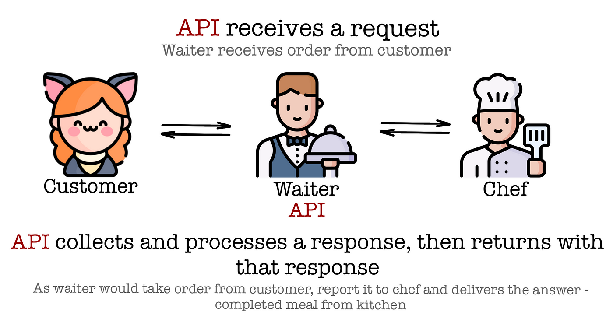

# Learn FastAPI

## 1 - What's an API
API stands for Application Programming Interface.
We use APIs to create a connection between two softwares, e.g: Server and Client.

**Real World Example:**



## 2 - Why FastAPI

- **Industry Standard**
- **Easy to use**
- **Provides automatic documentation**


# 3 - Installation

**We are using uv here but you can use pip as well !**

Open your IDE in a new empty folder, then follow these commands one by one in order.

```python
uv init # initializes a uv project

uv venv # creates a virtual environment

.venv\Scripts\activate #activates the virtual environment

uv add fastapi # installs fastapi package (ASGI Server)

uv add uvicorn # installs uvicorn packag

```

#### What is uvicorn:
We need a server to run our apis, because apis run on server.
uvicorn executes apis on your local machine and considers it as a local server.

In real world we execute apis on a remote server

#### What is ASGI Server

ASGI stands for Asynchronous Server Gateway Interface

Thousands of users use same API at the same time, so our API should be able to handle multiple requests asynchronously and ASGI allows us to do that.

